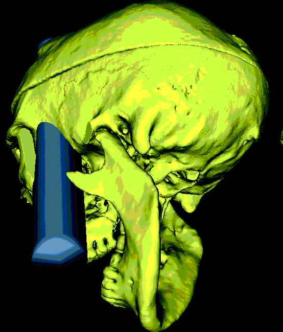

# Phineas Gage: A Case Study

Nathan Kulzer

---

## Background

* Worker on the Hudson River Railroad
* Little information on education or age
* <q>Hard-working</q>, <q>responsible</q>

---

## Incident

* Phineas Gage was detonating holes in a mountain
  * System of gunpowder (to trigger explosion) plus sand (to absorb shockwave)
  * The stack was struck with a metal pole to trigger the gunpowder
* He was distracted while filling up a hole for detonation
* Due to this distraction, he forgot the sand, which meant nothing was absorbing the force

* The explosion launched his iron into his head
* Pierced his skull and brain
* His frontal lobe was severely damaged

<!--
Explain what happened; maybe metal pole of some sort for demonstration? [click] point at stuff and stuff, show path of pole. [amphis would be funny here] “want to see what it looked like? [click]
-->

---

## Effects

* Early observations were taken by Gage's friend, John Harlow:

> The equi­lib­rium or balance, so to speak, between his intel­lec­tual fac­ul­ties and animal pro­pen­si­ties, seems to have been destroyed. He is fitful, irreverent, indulging at times in the grossest profanity (which was not pre­vi­ous­ly his custom), manifesting but little deference for his fellows, impatient of restraint or advice when it conflicts with his desires, at times per­ti­na­cious­ly obstinate, yet capricious and vac­il­lat­ing, devising many plans of future operations, which are no sooner arranged than they are abandoned in turn for others appearing more feasible. A child in his intel­lec­tu­al capacity and man­i­fes­ta­tions, he has the animal passions of a strong man. Previous to his injury, although untrained in the schools, he possessed a well-balanced mind, and was looked upon by those who knew him as a shrewd, smart business man, very energetic and persistent in executing all his plans of operation. In this regard his mind was radically changed, so decidedly that his friends and acquaint­ances said he was "no longer Gage."

<small style="margin-top: -1.4em; text-align: right; display: block;">Harlow, *Recovery from the Passage of an Iron Bar through the Head*</small>

* Gage was able to move and function relatively quickly
* Gage eventually returned to normal social behavior

---

## Aftermath

* Gage moved to Chile and held down a stagecoach job
  * Being a stagecoach required having a good personality:
    > \[Drivers should\] be reliable, resourceful, and possess great endurance. But above all, they had to have the kind of personality that enabled them to get on well with their passengers.
* Gage eventually died during a seizure (1860-05-21)

<!--
Mention Gage's job requiring good personality
-->

---

## Contributions

* Demonstrated brain locality
* Helped prove brain plasticity

<!--
brain locality - the fact that certain parts of the brain do certain things
brain plasticity - ability to repair / modify from damage
-->

---

## Misconceptions

<!-- this code is bullshit -->

<ul>
<disproved>
    Gage's personality was permanently changed by his injury.
    <template #disproof>
        Evidence suggests Gage made a near-complete recovery to his former self within a few years. 
    </template>
</disproved>
<disproved>
    Gage mistreated his wife and children
    <template #disproof>
        True only vacuously &mdash; Gage had no wife or children
    </template>
</disproved>
<disproved>
    Gage had difficulty holding down work after his injury.
    <template #disproof>
        Gage led a relatively normal life after his injury, and was able to hold jobs. He only had difficulty holding down work shortly before he died.
    </template>
</disproved>
</ul>

---
background: "#000000"
---

## Sources

* Ratiu, Peter, et al. “The Tale of Phineas Gage, Digitally Remastered.” Journal of Neurotrauma, vol. 21, no. 5, May 2004, pp. 637–43. Crossref, https://doi.org/10.1089/089771504774129964.
* Macmillan, Malcolm, and Matthew L. Lena. “Rehabilitating Phineas Gage.” Neuropsychological Rehabilitation, vol. 20, no. 5, Oct. 2010, pp. 641–58. Crossref, https://doi.org/10.1080/09602011003760527.
